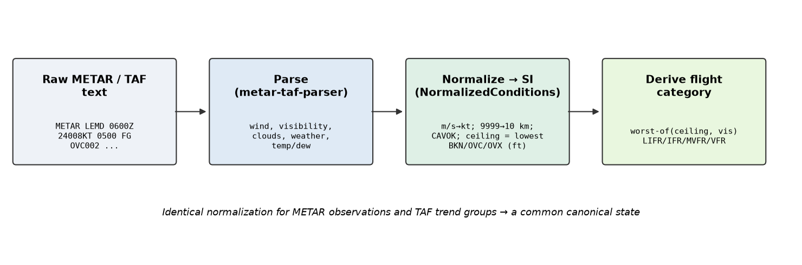
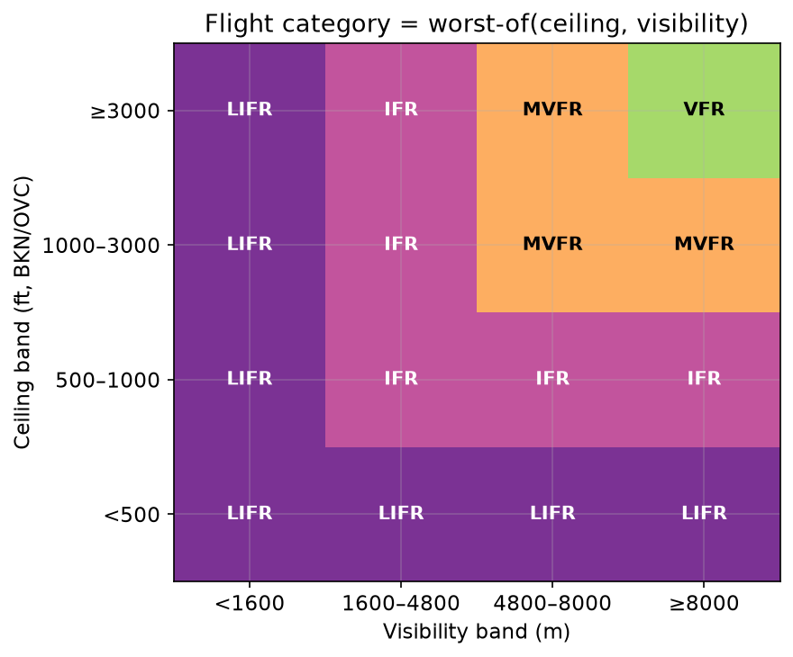
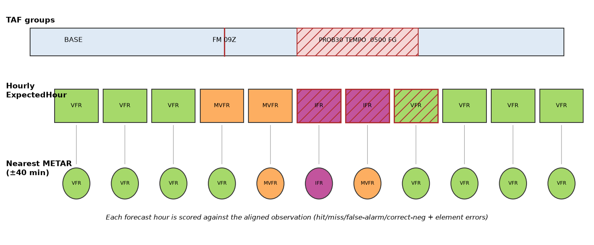
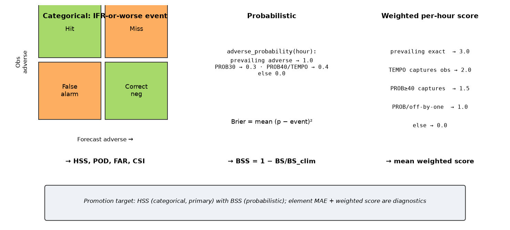

# Generating Probabilistic Aerodrome Forecasts (TAFs) from Numerical Weather Prediction: A Benchmark-Driven Model Review

*Working review — Spanish airport network, 2020–2025. Companion artifacts in this repository.*

## Abstract

We study whether machine-learning models can produce skilful, well-calibrated aerodrome
forecasts (TAFs) from numerical weather prediction (NWP) and recent observations, and
whether they can beat the official human-issued TAF. Using a strictly causal feature
frame over 24 Spanish airports (2.5 M METARs, 0.25 M TAFs, ERA5 reanalysis as a
perfect-prognosis NWP proxy), we benchmark a ladder of models — linear, gradient-boosted
trees, a GPU multi-task MLP — and a family of sequence/probabilistic models (GRU, LSTM,
Transformer, TCN, and a Temporal Fusion Transformer with quantile outputs). All models are
scored on a frozen 2025 test set with the Brier Skill Score (BSS) for the IFR-or-worse
event and the Heidke Skill Score (HSS), against the official TAF skyline. The best model is
a **logistic stacked ensemble of {MLP, gradient boosting, TFT}** reaching **BSS +0.348 /
HSS 0.513**, versus the official TAF's **−0.108**, and it is near-perfectly calibrated.
Driving PROB/TEMPO group generation with it yields an operational TAF at **BSS +0.215**.
We find that model **architecture is not the limiting factor**; data scaling, model class,
and the available feature set all plateau around BSS ≈ +0.33, indicating a **data ceiling**
set by the NWP fields ingested and the perfect-prognosis setup.

## 1. Objective

The official TAF is a categorical, human-issued forecast. Our goal is a model that, given
information available at issue time T₀, predicts the hourly aerodrome state over the TAF
validity window (vis, ceiling, wind, and the derived flight category) **probabilistically**,
so it can (a) be scored fairly against the official TAF and (b) drive automatic generation
of PROB/TEMPO change groups. The headline event is **IFR-or-worse** (ceiling/visibility
below instrument-flight thresholds) — the operationally critical, and rare (~3.6%), case.

## 2. Data and problem setup

- **Targets:** METAR-derived vis, ceiling, wind, and flight category at valid time t.
- **Features (strictly causal, enforced structurally):** current + lagged METAR state
  (t₀, −1/−3/−6 h, with tendencies), ERA5 fields at t and T₀ and the T₀→t tendency, lead
  time, cyclical hour/day, and static airport attributes. ERA5 is **perfect-prognosis**:
  reanalysis joined at the valid hour, a stand-in for an IFS forecast issued at T₀.
- **Splits (temporal, blocked):** train < 2024, validation = 2024, **frozen test = 2025**.
  Calibration is fit on validation; the test set is touched only for final scoring.

Full implementation: `src/wx/ai/dataset.py` (causal frame + leakage audit),
`src/wx/ai/seq_dataset.py` (windowed sequences for the deep models).

## 3. Verification: how TAFs and METARs are parsed, scored, and combined

The benchmark is only as trustworthy as its scoring. Because a TAF (a forecast over a
*window* with change groups) and a METAR (a point *observation*) are different objects, the
verifier reduces both to a **common canonical state per hour** and scores them with one set
of pure functions, so the official TAF and any model are judged identically. The pipeline
has four stages: parse → normalize → expand & align → score & combine.

### 3.1 Parsing and normalization

Raw METAR and TAF text are parsed (the `metar-taf-parser` library) and each report — and
each TAF trend group — is reduced to the **same** `NormalizedConditions` record
(`src/wx/parsing/normalize.py`): wind (direction, speed, gust), visibility, ceiling,
cloud layers, weather phenomena. Normalization handles the messy conventions:

- **Wind:** units coerced to knots (m/s, km/h → kt); variable direction (`VRB`) → unknown.
- **Visibility:** metres; the ICAO `9999` code → 10 km ("10 km or more"); `CAVOK` → ≥10 km.
- **Ceiling:** the lowest **BKN/OVC/OVX** layer height (ft), or the vertical visibility when
  the sky is obscured. (Scattered/few layers do *not* constitute a ceiling.)
- **Weather** (e.g. `BR`, `+RA`, `FG`) and **clouds** are recorded as structured tokens.



### 3.2 The key combination: flight category = worst-of(ceiling, visibility)

The single most important reduction is the **flight category**, which collapses two
components — ceiling and visibility — into one operational state by taking the **most
restrictive** of the two band classifications (`flight_category`). Bands (ICAO/metric):
LIFR `< 500 ft / 1600 m`, IFR `< 1000 ft / 4800 m`, MVFR `< 3000 ft / 8000 m`, else VFR. A
missing ceiling is treated as unlimited; with neither ceiling nor vis known the hour is
unclassifiable. This worst-of rule is where cloud/ceiling and visibility *combine*, and it
defines the headline event the whole benchmark optimizes: **IFR-or-worse** (IFR or LIFR).



### 3.3 Expanding a TAF to an hourly timeline, and aligning observations

A parsed TAF is a set of groups: a `BASE`, instantaneous `FM` changes (full state replace),
gradual `BECMG` transitions (merge, complete by the group's end), and `TEMPO`/`PROBxx`
overlays. `timeline.expand` walks the validity window hour by hour, applying the
chronological `FM`/`BECMG` transitions to produce the **prevailing** state for each hour and
attaching any active `TEMPO`/`PROB` group as an overlay. Each forecast hour
(`ExpectedHour`) is then matched to the **nearest METAR within ±40 min** (`align.py`);
METARs are ~half-hourly, so each top-of-hour reliably finds its observation.



### 3.4 Per-hour scoring of each component

For every aligned (forecast hour, observation) pair `scores.score_hour` records:

- **Element errors** (signed/absolute): wind speed (kt), wind direction (angular degrees,
  wrapped to ≤180°), visibility (m), ceiling (ft). These are **diagnostic MAEs** — tracked
  but not folded into the headline metric. *Temperature is not scored:* a TAF's base carries
  no spot temperature, and weather phenomena (`BR`/`RA`/…) are recorded but not scored
  independently — their operational effect enters through visibility/ceiling and hence the
  category.
- **Categorical outcome** for the IFR-or-worse event: a 2×2 contingency
  (hit / miss / false-alarm / correct-negative). The forecast is counted as "adverse" if
  *any* of its prevailing/TEMPO/PROB categories is adverse — so a hedge counts as a warning.
- **Forecast probability** `adverse_probability`: a hedge-aware P(IFR-or-worse) — `1.0` if
  the prevailing state is adverse, else the strongest adverse overlay (PROB30 → 0.3,
  PROB40/bare-TEMPO → 0.4). Baselines with only a prevailing state collapse to a hard 0/1.
- **Weighted score** (0–3): a pragmatic per-hour skill that credits an exact prevailing
  category (3), a TEMPO that captures the obs (2), a PROB that captures it (1–1.5), or an
  off-by-one prevailing (1) — taking the best available credit.

### 3.5 Combining hours into the optimized metrics

Pooling the per-hour outputs over the test set yields the headline scores
(`scores.skill_scores`):

- **HSS** (Heidke Skill Score) from the contingency table — the **primary categorical
  metric and the promotion target**; also POD, FAR, CSI, bias.
- **BSS** (Brier Skill Score) from the `adverse_probability`/event pairs vs the
  climatological base rate — the **probabilistic metric**; reliability (§5.3) checks its
  calibration. Both carry bootstrap CIs.
- The **mean weighted score** is reported as a single pragmatic combined number, but model
  selection/promotion is decided on **HSS** (with BSS as the probabilistic view).

So "everything combined into one metric" is precise: ceiling ∧ visibility combine (worst-of)
into the flight category; the category defines the adverse event; and HSS/BSS score that
event. Wind/element errors and temperature are reported alongside but are not part of the
optimized objective.



A key methodological lesson sits inside this machinery: **calibration is decoupled from the
decision threshold**. Class-weighted models discriminate well but produce poorly-scaled
probabilities; isotonic calibration on validation plus a separately-tuned HSS threshold
fixes both. A subtle bug where a class-weighted classifier's raw argmax — not the calibrated
decision — drove the forecast category cost the MLP ~0.16 HSS in the verifier path until
corrected.

## 4. Models tested

| Family | Model | Notes |
|--------|-------|-------|
| Baselines | persistence, climatology, **official TAF** | reference / skyline |
| Tabular ladder | linear/logistic, **gradient boosting (gbm)**, **GPU multi-task MLP** | sklearn + a PyTorch shared-trunk MLP |
| Sequence | GRU seq2seq, **LSTM + cross-attention**, Transformer enc-dec, TCN | encoder over past METAR, decoder over known-future ERA5 |
| Probabilistic | **Temporal Fusion Transformer (TFT)** | GRN + static enrichment + masked attention + **quantile heads** |
| Ensemble | linear blend, **logistic stack** | over base-model calibrated probabilities |

All deep models share one framework (`src/wx/ai/{torch_models,seq_models,tft_models}.py`),
the same calibration contract, and the same evaluation, so comparisons isolate the model.

## 5. Results

### 5.1 Model comparison

Every learned model beats the official TAF decisively on probabilistic skill; the official
TAF's over-committed categorical style scores **BSS −0.108**. Among single models the MLP
leads (+0.316); ensembling lifts skill further.


### 5.2 Ensembling is the only lever that helped

A logistic stack over base-model probabilities (fit on 2024, tested on 2025) reaches
**BSS +0.348 / HSS 0.513**. Ablation shows **LSTM is redundant** (≈ TFT) — `{MLP, gbm, TFT}`
matches the full four-model stack — and the TFT (sequence model) contributes **+0.011** of
genuine NWP-sequence signal over the tabular-only `{MLP, gbm}` stack.


### 5.3 Calibration

The stacked ensemble is **near-perfectly calibrated**: forecast probability matches observed
frequency to within ±0.01 across the full range — the property that makes PROB30/PROB40
groups meaningful.


### 5.4 Skill vs lead time and region

Skill decays gracefully from **+0.503 at +1 h to +0.295 at +30 h**, staying far above the
official TAF at all leads. By region it ranges from the Canaries (+0.451, a predictable
regime) to Melilla (+0.127, hardest, small sample).


### 5.5 The ceiling: scaling and architecture

The TFT improves with data then **plateaus by ~60% sample** (BSS +0.189→+0.229→+0.271→
+0.271 at 25/40/60/100%). The tabular models saturate even earlier (~5%). And across GRU,
LSTM, Transformer, TCN and TFT backbones the skill clusters within ~0.02 — **architecture
is not the lever**. Together these point to a **data ceiling**, not a modelling one.


## 6. Generating PROB/TEMPO TAFs

The stacked P(adverse) is quantized to the TAF's expressible buckets (none / PROB30 /
PROB40 / firm) and combined with the TFT's quantile element forecast to emit an hourly
ExpectedHour timeline with PROB/TEMPO groups (`src/wx/ai/prob_groups.py`). The regenerated
operational TAF scores **BSS +0.215** — versus the official TAF's −0.108. Example
(LEVT, an adverse morning):

```
LEVT issued 2025-06-16 11Z:
  +12h  VFR                       | obs MVFR
  +18h  VFR   PROB40 LIFR         | obs IFR      <- fog risk correctly flagged
  +24h  VFR                       | obs VFR
```

A notable finding: the TFT's **visibility quantiles collapse to "clear" even at q10** — the
rare low-visibility tail is not captured, so the adverse skill lives entirely in the
calibrated category probability, not the element distribution. Adverse groups therefore use
category-representative conditions for realism.

## 7. Discussion

Three independent levers — **data volume, model architecture, and feature set** — all
plateau around BSS ≈ +0.33. The feature set is exhausted because every *populated* NWP
field is already used; notably, ERA5's low/mid/high cloud-cover split (the obvious
ceiling/fog predictor) was never ingested (0% populated). Hyperparameter search on the MLP
returned only run-to-run noise. The single thing that helped beyond a well-calibrated MLP
was **ensembling diverse model classes**, and even that adds only ~+0.03 BSS.

## 8. Limitations and future work

- **Perfect-prognosis optimism.** ERA5 is joined at the valid hour, so absolute skill is
  optimistic relative to a real forecast. Validation against an IFS/ECMWF *reforecast*
  archive (issued at T₀) is the credibility milestone.
- **Richer NWP.** Re-ingesting ERA5 with cloud layers (lcc/mcc/hcc) is the most likely
  lever to raise the ceiling, and is pure data engineering.
- **Productionization.** Wiring the stacked ensemble as a live `Forecaster` (sequence
  inference at arbitrary T₀) so it runs the verifier promotion gate and can be registered
  as champion.

## 9. Conclusion

A calibrated, stacked ensemble of complementary model classes produces aerodrome forecasts
that are **substantially more skilful and better calibrated than the official TAF** on a
frozen 2025 test set (**BSS +0.348 vs −0.108**), and it can drive an operational PROB/TEMPO
TAF that retains most of that skill. The current ceiling is set by the data, not the models:
the highest-value next step is richer / genuine-forecast NWP, not a larger network.

---

*Reproducibility: figures via `research/figures/make_figures.py`; experiment log in
`data/research_log.jsonl`; full session journal in `docs/AUTONOMOUS_RESEARCH.md`; model
ladder and ensemble recipe in `docs/PHASE_D_ROADMAP.md`.*
